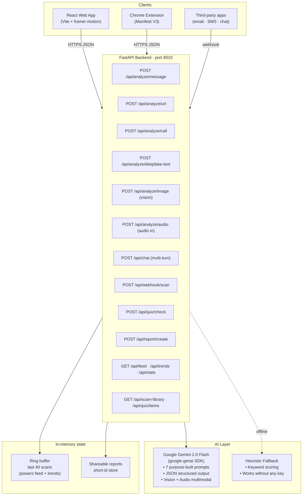

# Aegis AI — The AI Shield That Beats AI Scams

**ForgeHacks 2026 — Track: AI + Cybersecurity**

> _"Build an AI-powered solution that helps people recognize, prevent, verify, or respond to scams, impersonation, and fraud enabled by AI or modern technologies."_

Aegis AI is an open-source, Gemini-powered defense system that detects phishing, voice-clone fraud, deepfake text, screenshot scams, and impersonation attacks in real time — so grandparents, employees, and everyday people never fall for the next AI-powered trick.

---

## Problem Statement

In 2026, scams cost people **4.6 trillion dollars globally**. The reason it is exploding is AI:

- **Deepfake fraud grew 3000 percent year over year.** Scammers clone a grandchild's voice from a three-second TikTok clip and call grandma asking for bail money.
- **AI phishing is undetectable to humans.** Studies show humans correctly identify AI-generated phishing emails only 46 percent of the time — a coin flip.
- **CEO voice-fraud wire transfers** are draining enterprise budgets. The Arup case alone lost 25 million dollars on a single deepfake video call.
- **The elderly, non-technical users, and small businesses** are hit the hardest and have the fewest tools.

The scammers have AI. The victims do not. Aegis AI closes that gap.

### Target users

- **Everyday people and families** — anyone receiving suspicious texts, emails, screenshots, or calls, especially elders.
- **Small and medium businesses** — finance, HR, and support teams who are the usual targets of CEO-fraud and invoice-fraud.
- **Platform integrators** — email providers, telcos, banks, chat apps, and bots embedding Aegis via a single webhook.

---

## Solution — Six AI Shields plus Four Protection Features

### Six scanners (all powered by Gemini)

| # | Shield | What it does |
|---|---|---|
| 1 | Message Scanner | Paste any SMS, email, DM, or chat. Returns a 0–100 threat score, scam category, red flags, urgency tactics, and plain-English recommendations. |
| 2 | URL / Phishing Check | Detects typosquatting (paypa1.com), look-alike domains, suspicious TLDs, shortened phishing. Suggests the real safe URL. |
| 3 | Voice Call Analyzer | Paste a call transcript. Flags grandparent, IRS, tech-support, and voice-clone scams with a deepfake-voice likelihood score. |
| 4 | Screenshot Scanner (Gemini Vision) | Upload a screenshot of a suspicious message, email, website, or notification. Gemini reads the text and flags visual scam signals. |
| 5 | Voice Recording Analyzer | Record audio in your browser. Gemini transcribes it, scores deepfake voice likelihood, and flags scam tactics. |
| 6 | AI-Text Detector | Spots content generated by ChatGPT, Claude, or Gemini and estimates whether it is being used maliciously. |

### Dual-Shield verdicts (optional)

Every message scan can be cross-checked by a second open-source LLM for a two-opinion verdict with an agreement flag. The code is pluggable (any OpenAI-compatible endpoint works); it stays silent when no second-model key is set, so Gemini-only mode is the default and complete experience.

### Four engagement and protection features

| Feature | What it does |
|---|---|
| Aegis Assistant Chatbot | Floating chatbot on every page, powered by Gemini. Ask about any scam, paste a message, or get recovery guidance if you were already scammed. |
| Live Threat Feed | Real-time, anonymized stream of what Aegis is catching. Updates every four seconds. |
| Scam Trends Dashboard | Live-animated charts showing verdict breakdown, score distribution, 24-hour threat volume, and channel split. All computed from the in-memory scan buffer. |
| Spot-the-Scam Quiz | Twelve real-world messages. Guess which ones are scams. Aegis teaches you why — building durable instincts, not just alerts. |
| Family Safe Word | Generate and share a family safe word to defeat voice-clone grandparent scams. Saved locally in the browser, never sent to any server. |
| Panic Button | Floating red button in the corner for people being scammed right now. Four-step emergency guide + direct FTC/FBI/988 hotlines. |

### Integration surface

- **Public Integration API** — one webhook endpoint (`POST /api/webhook/scan`). Copy-paste snippets for cURL, JavaScript, Python, and generic webhooks are built into the site.
- **Chrome Extension** — right-click any text or link on any webpage; Aegis scans it and shows a desktop verdict notification.
- **Scam Playbook Library** — eight curated real-world scams with examples, red flags, and family-safe actions.

---

## Technical Approach

### Architecture



### Components used

- **Frontend** — React 18 with Vite, framer-motion for micro-animations, lucide-react icons, custom CSS design system (orange and off-white, bento grid, image card hero, floating chat panel, inline SVG charts).
- **Backend** — FastAPI on Python 3.10+, Pydantic v2 for validation, `google-genai` SDK, Uvicorn as the ASGI server, in-memory ring buffer for the live feed and trends.
- **AI** — Google Gemini 2.0 Flash Experimental. Multimodal (text, image, audio) with structured JSON output via `response_mime_type`.
- **Pluggable dual-shield** — any OpenAI-compatible endpoint can be wired as a second-opinion checker. Entirely optional; the code auto-disables if no key is set.
- **Chrome Extension** — Manifest V3, context menu plus popup, desktop notifications.
- **Resilience** — Every scanner and the chatbot have a graceful heuristic fallback when no API keys are set, so the demo always runs.

### Key endpoints

| Method | Path | Purpose |
|---|---|---|
| POST | /api/analyze/message | Scam and phishing analysis |
| POST | /api/analyze/url | URL phishing and typosquatting detection |
| POST | /api/analyze/call | Voice-call scam plus deepfake-voice score |
| POST | /api/analyze/deepfake-text | AI-generated text detector |
| POST | /api/analyze/image | Screenshot OCR and scam detection (Gemini Vision) |
| POST | /api/analyze/audio | Voice transcription and deepfake detection (Gemini Audio) |
| POST | /api/chat | Multi-turn chatbot assistant |
| POST | /api/webhook/scan | Public integration endpoint for third parties |
| POST | /api/quiz/check | Submit a quiz guess |
| POST | /api/report/create | Store a shareable scan report |
| GET  | /api/feed | Live anonymized stream of recent scans |
| GET  | /api/trends | Verdict / score / channel / 24h distribution |
| GET  | /api/stats | Totals and fun facts |
| GET  | /api/scam-library | Curated scam encyclopedia |
| GET  | /api/quiz/items | Shuffled quiz questions |
| GET  | /api/report/{id} | Fetch a shared report |

---

## Real-World Impact

- **Protects the elderly** — the most common voice-clone scam target. Family members can forward a suspicious message or screenshot to Aegis and get a plain-English verdict in two seconds.
- **Protects small businesses** — a finance clerk can paste a wire-transfer email into Aegis before sending 85,000 dollars.
- **Protects everyone with a phone** — the UI is deliberately simple. Paste or upload, see the verdict, read what to do.
- **Teaches, not just alerts** — the Scam Library, the Spot-the-Scam Quiz, and the Chatbot build durable instincts.
- **Preventative** — the Family Safe Word tool directly defeats voice-clone grandparent scams, which cannot be solved by any detector.
- **Emergency mode** — the Panic Button walks real-time victims through four safe steps and gives direct hotline numbers for the FTC, FBI IC3, and 988.
- **Open source** — anyone can self-host. Messaging apps, banks, and telcos can embed the webhook API for free.
- **Multi-channel coverage** — the browser extension catches scams in real time while browsing, the webhook API protects email/SMS/chat upstream, and the web app covers manual pastes and uploads.

---

## Quick Start

### 1. Backend (FastAPI plus Gemini)

```powershell
cd backend
python -m venv .venv
.venv\Scripts\Activate.ps1          # Windows PowerShell
# source .venv/bin/activate         # macOS / Linux

pip install -r requirements.txt

copy .env.example .env              # Windows
# cp .env.example .env              # macOS / Linux

# Edit .env and set GEMINI_API_KEY
# Get a free key at https://aistudio.google.com/apikey

python main.py                      # starts on http://localhost:8010
```

### 2. Frontend (React plus Vite)

```powershell
cd frontend
npm install
npm run dev                         # starts on http://localhost:5173 (or next free port)
```

### 3. Chrome Extension (optional)

```
chrome://extensions  →  Developer mode on  →  Load unpacked  →  select extension/
```

Right-click any text or link on any webpage, choose **Aegis AI → Scan this for scams**, and a desktop notification shows the verdict.

---

## Demo Script (two to four minutes)

1. **Hook (0:00–0:20)** — "In 2026, scammers use AI. The people they target do not. That ends today."
2. **Problem (0:20–0:45)** — Deepfake fraud: 25-million-dollar Arup case, grandparent voice-clone scams, 3000 percent year-over-year growth.
3. **Message Scanner (0:45–1:20)** — Paste a fake Chase phishing SMS. Aegis returns DANGEROUS 92/100 in under two seconds with red flags and recommended actions.
4. **Screenshot Scanner (1:20–1:40)** — Upload a screenshot of a scam text. Gemini OCRs and flags visual signals.
5. **Voice Recording (1:40–2:00)** — Record "This is the IRS, pay in gift cards". Transcribed with deepfake voice score.
6. **Trends Dashboard + Live Feed (2:00–2:20)** — Scrolling live feed, animated donut and line charts of what Aegis is catching.
7. **Spot the Scam quiz (2:20–2:35)** — Judge plays one round. Correct or wrong, Aegis explains why. "Humans catch 46%. You can do better."
8. **Family Safe Word + Panic Button (2:35–2:50)** — Show the safe word tool and the emergency guide. The two features that save real lives.
9. **Chatbot + Integration API + Extension (2:50–3:00)** — Open chatbot. Show the cURL snippet. Right-click scan in Chrome. Impact close.

---

## Project Structure

```
ForgeHacks/
  backend/
    main.py                     FastAPI app, 15+ routes
    requirements.txt
    .env.example                Gemini + optional Featherless keys
    services/
      gemini_service.py         Gemini wrapper (text, image, audio, chat) + heuristic fallback
      featherless_service.py    optional second-opinion provider (disabled by default)
  frontend/
    package.json
    vite.config.js              proxies /api to :8010
    index.html
    public/favicon.svg
    src/
      main.jsx
      App.jsx
      index.css                 full design system
      components/
        Navbar.jsx
        Hero.jsx                image card hero
        StatsStrip.jsx
        Features.jsx            6-shield bento grid
        Scanner.jsx             6 scanner tabs incl. image upload + voice record
        LiveFeed.jsx            real-time anonymized feed
        TrendsDashboard.jsx     4 live-animated charts
        QuizGame.jsx            Spot-the-Scam interactive game
        SafeWord.jsx            Family safe-word generator
        PanicButton.jsx         Floating emergency guide
        UseCases.jsx            Image-rich target-user cards
        IntegrationAPI.jsx      cURL / JS / Python / webhook snippets
        Integrations.jsx
        ScamLibrary.jsx
        ChatBot.jsx             Floating chat on the right
        CTA.jsx
        Footer.jsx
  extension/                    Chrome extension, Manifest V3
    manifest.json
    background.js               context-menu scan
    popup.html, popup.js
    README.md
  README.md
  start.ps1                     one-click dev launcher
  .gitignore
```

---

## Submission Checklist (ForgeHacks)

- [x] Project title and short description — top of this README
- [x] Track selection: **AI + Cybersecurity**
- [x] GitHub repo with source code and clear README — this file
- [x] Problem statement and target users — above
- [x] Technical approach and components — above
- [x] Architecture diagram — Mermaid above
- [x] Real-world impact statement — above
- [ ] **TODO (user action):** Public demo video (2–4 min) posted to YouTube
- [ ] **TODO (user action):** Push repo to public GitHub
- [ ] **Optional:** Deploy to Render / Railway / Vercel for a public test link

---

## Roadmap

- **WhatsApp bot** — forward suspicious messages to Aegis via WhatsApp.
- **Real-time voice-call stream** — microphone → Gemini live, scored as the call happens.
- **Family mode** — one-tap "ask Aegis for me", auto-share the result to a trusted family member.
- **Threat intel feed** — community-reported scams feed a shared knowledge base.
- **Mobile apps** — iOS and Android share-sheet integration.

---

## License

MIT. Use it, embed it, ship it. If you use it to protect someone's grandparent, we did our job.

---

Built for ForgeHacks 2026 — AI + Cybersecurity track.
